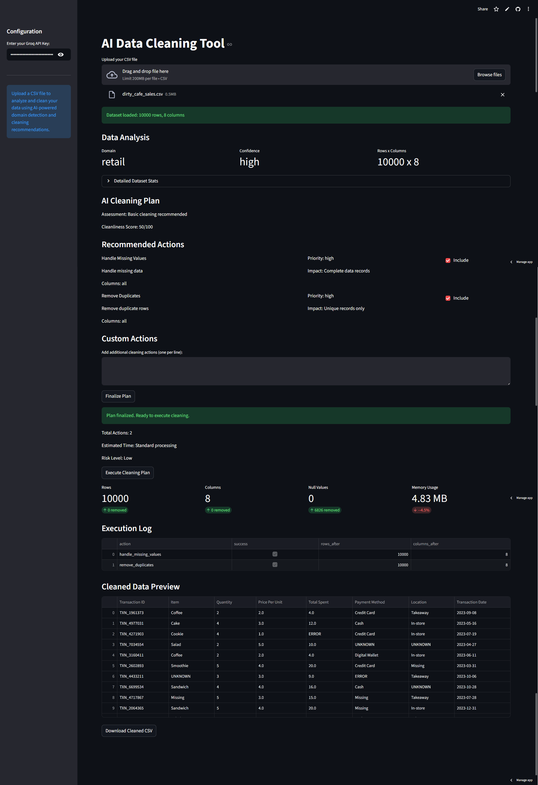
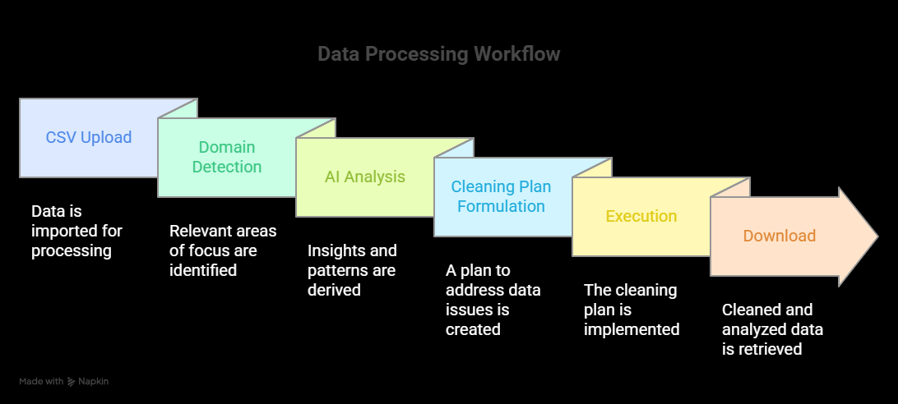
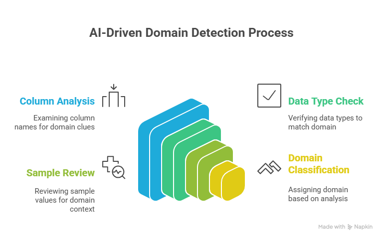
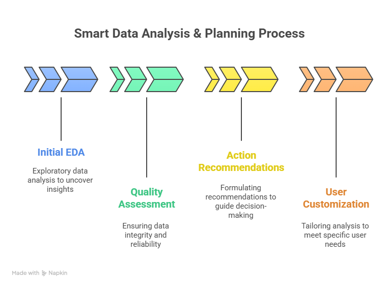
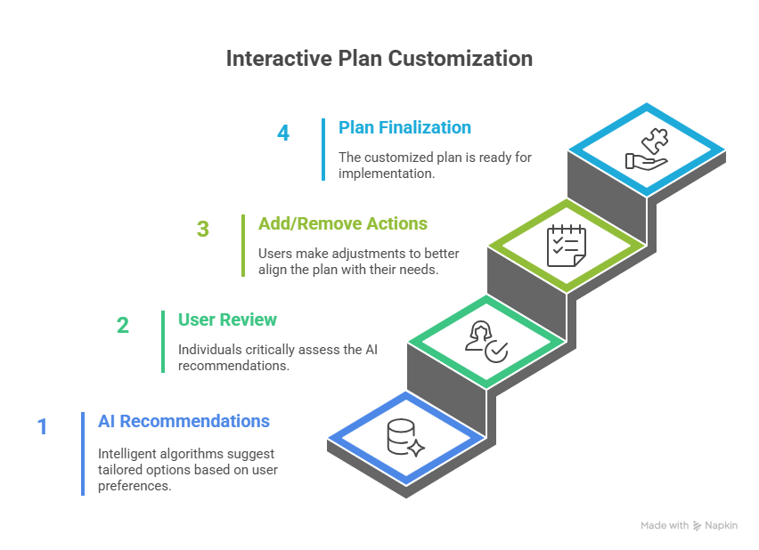
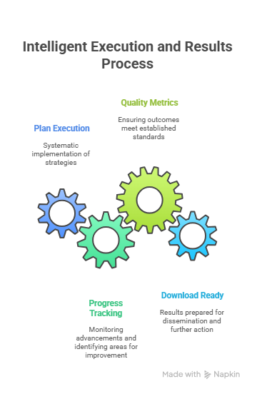
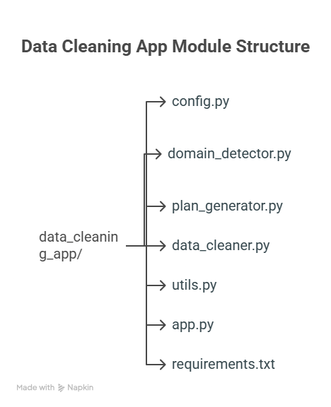

# AI Data Cleaning Tool

[Try the app now on : clean-dataset.streamlit.app](https://clean-dataset.streamlit.app/)

    

An intelligent data cleaning application that uses AI to automatically analyze, detect domains, and clean your datasets with domain-specific intelligence.


## Quick Start

### Prerequisites

- Python 3.8+
- Groq API Key (Get it from https://console.groq.com/)

### Installation & Setup

1. Create Virtual Environment

```bash
   python -m venv venv
   venv\Scripts\activate (Windows)
   source venv/bin/activate (Mac/Linux)
```

2. Install Dependencies

```bash
   pip install -r requirements.txt
```

3. Run the Application

```bash
   streamlit run app.py
```

4. Configure API Key

- Open the app in your browser
- Enter your Groq API key in the sidebar
- Upload your CSV file

## How It Works

### Workflow Overview

CSV Upload -> Domain Detection -> AI Analysis -> Cleaning Plan -> Execution -> Download


### Detailed Flow

#### 1. File Upload & Validation

- Upload any CSV file (up to 200MB)
- Automatic format validation
- Basic data integrity checks

#### 2. AI-Powered Domain Detection

Column Analysis -> Data Type Check -> Sample Review -> Domain Classification


- Supported Domains: Sales, E-commerce, Finance, Healthcare, Education, Weather, and 40+ more
- Intelligent Detection: Uses column names, data types, and sample values
- Confidence Scoring: High/Medium/Low confidence levels

#### 3. Smart Data Analysis & Planning

Initial EDA -> Quality Assessment -> Action Recommendations -> User Customization


- Comprehensive EDA: Shape, null values, duplicates, data types
- Cleanliness Scoring: 0-100 score with detailed assessment
- Domain-Specific Rules: Tailored cleaning for each domain

#### 4. Interactive Plan Customization

AI Recommendations -> User Review -> Add/Remove Actions -> Plan Finalization


- 60+ Cleaning Actions: Missing values, duplicates, outliers, formatting, etc.
- Priority Levels: High/Medium/Low impact actions
- Custom Actions: Add your own cleaning requirements

#### 5. Intelligent Execution & Results

Plan Execution -> Progress Tracking -> Quality Metrics -> Download Ready


- Smart Cleaning: Domain-aware missing value handling
- Progress Monitoring: Real-time execution tracking
- Quality Metrics: Before/After comparison
- Instant Download: Cleaned CSV ready for use

## Technical Architecture

### Module Structure

```text
data_cleaning_app/
- config.py: Configuration & constants
- domain_detector.py: Domain detection logic
- plan_generator.py: AI planning agents
- data_cleaner.py: Cleaning operations
- utils.py: Helper functions
- app.py: Streamlit UI
- requirements.txt: Dependencies
```



### AI Agents System

#### Agent 1: Domain Analyst

- Analyzes dataset structure
- Detects domain context
- Assesses data quality
- Generates initial recommendations

#### Agent 2: Plan Finalizer

- Incorporates user feedback
- Creates executable action sequence
- Validates plan feasibility
- Estimates processing time

### Supported Cleaning Operations

Category: Data Quality (15+ actions)

- Handle missing values, remove duplicates, fix outliers

Category: Formatting (12+ actions)

- Standardize dates, clean text, normalize formats

Category: Type Conversion (8+ actions)

- Fix data types, encode categorical, normalize numeric

Category: Validation (10+ actions)

- Email, phone, URL validation, range checks

Category: Feature Engineering (5+ actions)

- Extract features, create derived columns

Category: Domain-Specific (10+ actions)

- Currency, medical codes, product SKUs

## Domain Intelligence

### Smart Missing Value Handling

Text Columns:

- Dates: Unknown Date
- Names: Unknown
- IDs: Not Provided
- Categories: Other

Numeric Columns:

- Prices/Amounts: 0
- Ages/Years: Median
- Ratings/Scores: Mean
- General: Median

### Domain-Specific Cleaning

- Sales: Currency formatting, customer ID validation
- Healthcare: Medical code standardization, age validation
- Finance: Account number validation, transaction formatting
- E-commerce: Product SKU standardization, price cleaning

## Supported Data Types

### Input Formats

- CSV files (any encoding)
- Mixed data types
- Large datasets (optimized processing)
- International characters

### Output Features

- Cleaned CSV download
- Before/After metrics
- Execution log
- Data quality report

## Deployment

### Streamlit Cloud Deployment

1. Fork this repository
2. Go to Streamlit Cloud (https://streamlit.io/cloud)
3. Connect your GitHub repository
4. Set main file path to app.py
5. Deploy

### Environment Variables

For production, set:

```bash
GROQ_API_KEY=your_api_key_here
```

## Usage Examples

### Example 1: Sales Data

Original: Mixed date formats, missing prices, duplicate records
Cleaned: Standardized dates, zero-filled prices, unique records

### Example 2: User Data

Original: Inconsistent emails, mixed phone formats, null ages
Cleaned: Validated emails, standardized phones, median ages

### Example 3: Product Data

Original: Varied SKU formats, missing categories, price outliers
Cleaned: Uniform SKUs, Other categories, outlier-treated prices

## Customization

### Adding New Domains

Edit domain_detector.py:

```python
def get_domain_specific_guidelines(domain):
guidelines = {
"your_domain": ["action1", "action2", ...]
}
```

### Adding Cleaning Actions

```python
Edit config.py:
CLEANING_ACTIONS = {
"your_action": "Description",
}
```

## Performance

- Processing Speed: Optimized for large datasets
- Memory Efficient: Chunk processing for big files
- Scalable Architecture: Modular design for easy extensions
- Error Handling: Graceful failure recovery

## Contributing

1. Fork the repository
2. Create feature branch

```bash
git checkout -b feature/AmazingFeature
```

3. Commit changes

```bash
git commit -m 'Add AmazingFeature'
```

4. Push to branch

```bash
git push origin feature/AmazingFeature
```

5. Open a Pull Request

## License

This project is licensed under the MIT License.

## Support

- Email: mdsameersayed0@example.com
- Issues: GitHub Issues
- Discussions: GitHub Discussions

Ready to clean your data? Upload your CSV and experience AI-powered data cleaning today.

```

```
